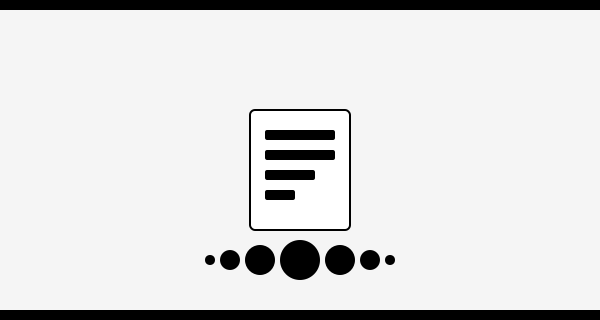

  
  

  <h><em>A Minimal Example</em></h>
  
A quick walkthrough of glmsusie on a simulated dataset to illustrate variable selection and confidence sets. [read more](mwe.html)
 
  

  
  

  <h><em>Gaussian Regression Examples</em></h>
  
Demonstration of glmsusie applied to generalized linear models and Cox regression model. [read more](gaussian.html)

  

  
  

  <h><em>Logistic Regression Examples</em></h>
  
Demonstration of glmsusie applied to generalized linear models and Cox regression model. [read more](logit.html)

  

  
  

  <h><em>Poisson Regression Examples</em></h>
  
Demonstration of glmsusie applied to generalized linear models and Cox regression model. [read more](poisson.html)

  

  
  

  <h><em>Cox Regression Examples</em></h>
  
Demonstration of glmsusie applied to generalized linear models and Cox regression model. [read more](cox.html)

  

